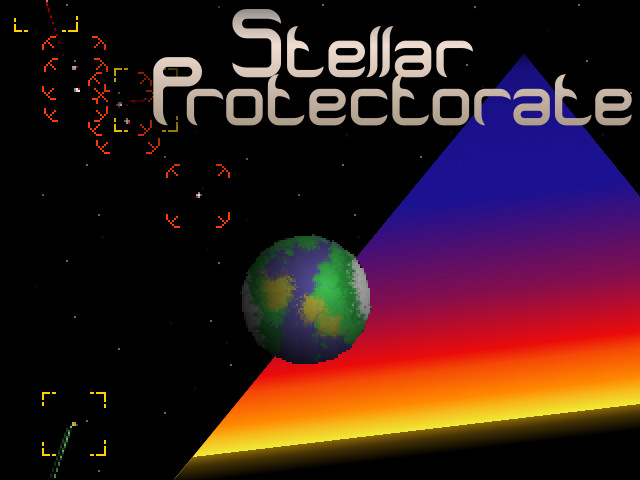
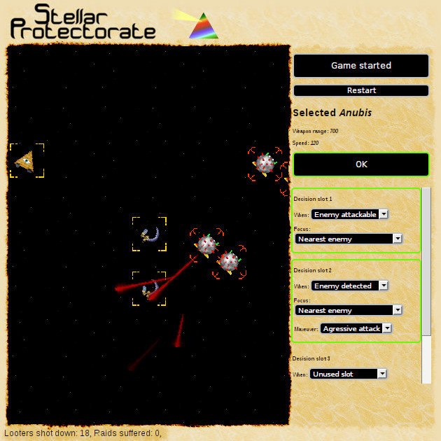
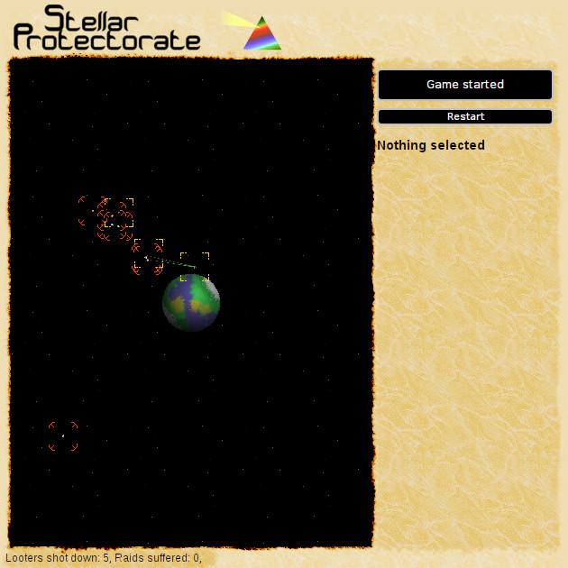

# Ludum Dare 36 game "Interstellar Protectorate"

Challenge theme "Ancient technology".

## Story

TL/DR: Configure the drones to defend the planet.

Deep in the mysterious tombs of Egypt's mighty pyramids lies artefact's from
another era. Perfectly cut stones describe a powerful civilization whose
footsteps go far a cross and deep into our moving earth. These creators seems to
have perished into the sands, but they did not. Their purpose was to seed our
minds with technological wonders. Giving us a taste of a interstellar
civilization.

To this day they are out there inspiring other world…

Interaction with these godlike beings comes at a price. Pesky looters flock
wherever they land. That’s why you have been given the Protectorate title and
the mission to set up a stellar defense system to fend of looters. Fend them of
long enough for the civilization to mature enough to defend themselves.

A civilization can only tolerate one landing squad of looters. After that they
will rebel against their interstellar benefactors and exile them.

Good luck. The fate of this entire planet lays on your shoulders.

## How to play

You have 3 drones that need to be configured to defend the planet. Click on a
drone to edit the properties of it. You can zoom in to enemies to get a closer
look at them.

When you’ve done your initial configuration and think you are ready to fend the
looters, click the button “Start invasion” button.

To win the game you must shoot down 100 looters and not let more then 1 looter
past your defenses.

If you find that time moves by slowly. Hold down the mouse button on the planet
in the middle to make time pass faster.

Have fun and Good luck!

## Screenshots

